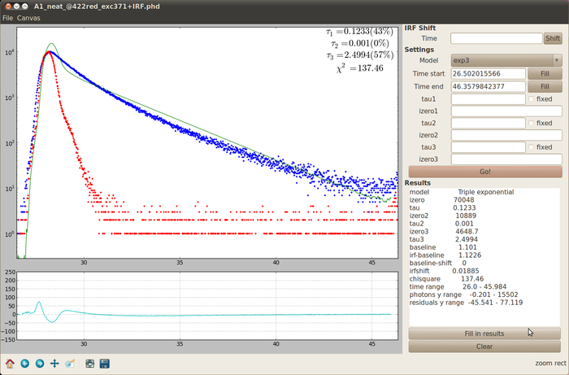

# About

UI for Importing data from picoharp300 and running curve fitting.

Fitting is built on top of [trfit](http://watcut.uwaterloo.ca/trfit/trfit) and
tr_fit is required to be available in python path.

